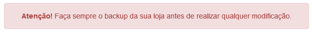
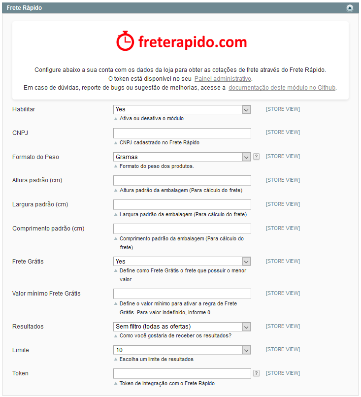
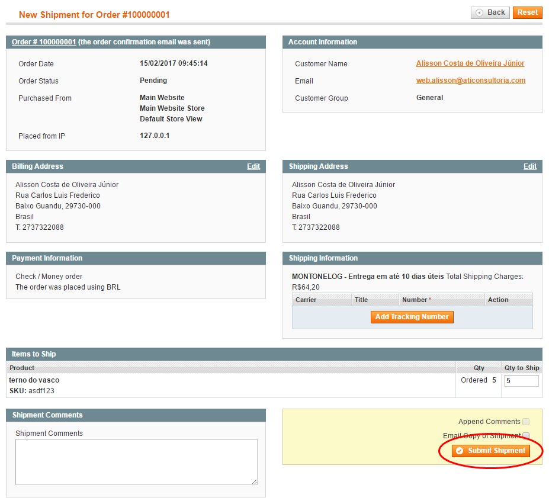
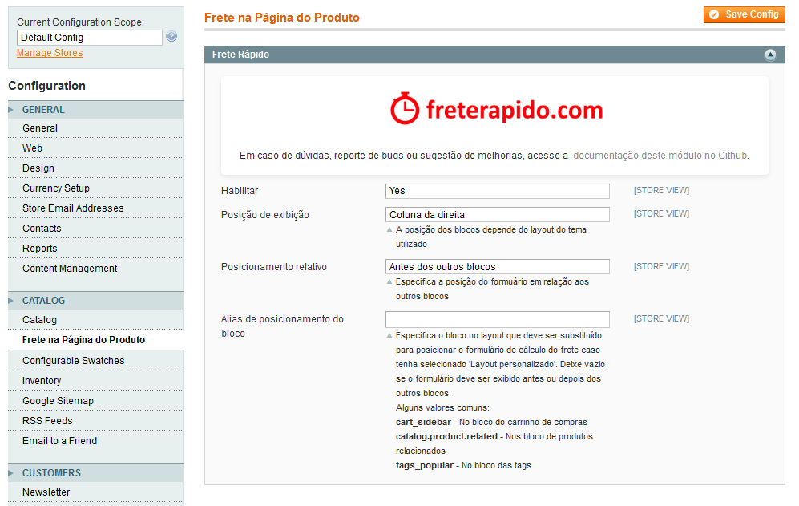

    

### **Módulo para plataforma Magento**

Versão do módulo: 1.2.0

Compatibilidade com Magento: **1.9.x**

Links úteis:

- [Magento Connect][1]
- [Painel administrativo][2]
- [suporte@freterapido.com][3]

Idioma: 

[][6] [][7]

----------

### Instalação

>**<i class="icon-attention"></i> ATENÇÃO!** Recomendamos que seja feito backup da sua loja antes de realizar qualquer instalação. A instalação desse módulo é de inteira responsabilidade do lojista.

- [Baixe a última versão aqui][4],  descompacte o conteúdo do arquivo zip dentro da pasta "app" da sua loja Magento.
- Verifique se o arquivo **local.xml** está habilitado na pasta "app/etc" da sua loja Magento. Caso não esteja, é só renomear o arquivo **local.xml.sample** para **local.xml**.
- Acesse a área administrativa de sua loja e limpe o cache em: Sistema > Gerenciamento de Cache.

----------

### Configurações

É necessário realizar algumas configurações na sua loja para obter total usabilidade do módulo **Frete Rápido**.

#### 1. Configurações do módulo:

- Agora, configure a nova forma de entrega: System > Settings > Shipping Methods > Frete Rápido (conforme imagem abaixo).

- **Habilitar:** Habilita ou desabilita o módulo conforme sua necessidade.
- **CNPJ:** CNPJ da sua empresa conforme registrado no Frete Rápido.
- **Formato do Peso:** Formato do valor do peso registrado para cada produto (Quilos ou Gramas).
- **Altura padrão (cm):** Define a altura padrão dos produtos que não tiverem altura informada.
- **Largura padrão (cm):** Define a largura padrão dos produtos que não tiverem altura informada.
- **Comprimento padrão (cm):** Define a comprimento padrão dos produtos que não tiverem altura informada.
- **Frete Grátis:**  Habilita o frete mais barato retornado pelo Frete Rápido como **frete grátis**.
- **Valor Mínimo Frete Grátis:**  Define o valor mínimo para ativar a regra de **Frete grátis**. Para valor **indefinido**, informe **0**.
- **Resultados:** Define como deseja receber as cotações.
- **Limite:** Permitir limitar, até 20, a quantidade de cotações que deseja apresentar ao visitante.
- **Token:** Token de integração da sua empresa disponível no [Painel administrativo do Frete Rápido][2] > Empresa > Integração.

#### 2. Remetente

- As informações sobre o remetente das mercadorias são muito importantes para sabermos qual a origem dos seus fretes. Acesse a área administrativa da sua loja e informe os dados de origem em: System > Settings > Shipping Settings > Origin.

> **Obs:** É importante informar todos os campos corretamente.

#### 3. Medidas e Prazo de fabricação:
- Para calcular o frete precisamos saber as medidas das embalagens de cada produto. Você precisa informá-las em: Catalog > Manage Products > [Selecionar produto] > menu Frete Rápido.

> **Atenção:** Considerar as dimensões e peso do produto com a embalagem pronta para envio/postagem.
> É obrigatório ter o peso configurado em cada produto para que seja possível cotar o frete de forma eficiente. As dimensões podem ficar em branco e neste caso, serão utilizadas as medidas padrões informadas na configuração do plugin, mas é recomendado que cada produto tenha suas configurações próprias de peso e dimensões.

#### 4. Categorias
- É necessário relacionar cada categoria da sua loja com as categorias do Frete Rápido em: Catalog > Manage Categories > Categoria no Frete Rápido.

> **Obs:** Nem todas as categorias da sua loja podem coincidir com a relação de categorias do Frete Rápido, mas é possível relacioná-las de forma ampla.
>
> **Exemplo 1**: Moda feminina -> Vestuário
>
> **Exemplo 2**: CDs -> CD / DVD / Blu-Ray
>
> **Exemplo 3**: Violões -> Instrumento Musical

--------

### Contratação do Frete
É possível contratar o frete diretamente na área administrativa da loja, no detalhamento do pedido do cliente.

* Abra o pedido (Sales > Orders) e clique no botão **"Ship"**.

* Você será redirecionado para a tela de confirmação do frete. Após conferir as informações, clique no botão **"Submit Shipment"**

* Neste momento, o Frete Rápido irá solicitar a coleta/despacho dos itens do pedido à transportadora escolhida.

--------

### Cálculo do frete na página do produto

- **Habilitar:** Habilita ou desabilita o bloco de cálculo na página do produto.
- **Posição de exibição:** Permite escolher a posição do bloco no layout da página do produto (o funcionamento dependerá da disposição do layout). As opções são:
	- Coluna da direita: adiciona na coluna da direita (caso haja).
	- Coluna da esquerda adiciona na coluna da esquerda (caso haja).
	- Bloco de informação adicional: adiciona após o bloco de descrição.
	- Layout personalizado: permite personalizar a posição no campo **Alias de posicionamento do bloco**.

- **Posicionamento relativo:** Permite escolher a posição do bloco em relação aos outros blocos da página.
- **Alias de posicionamento do bloco:** Permite especificar um bloco para ser substituído pelo bloco de cálculo do frete.

--------

### Observações gerais:
1. Para obter cotações dos Correios é necessário configurar o seu contrato com os Correios no [Painel administrativo do Frete Rápido][2] > Empresa > Integração.
2. Esse módulo atende cotações apenas para destinatários Pessoa Física.

--------

### Contribuições
Encontrou algum bug ou tem sugestões de melhorias no código? Sensacional! Não se acanhe, nos envie um pull request com a sua alteração e ajude este projeto a ficar ainda melhor.

1. Faça um "Fork"
2. Crie seu branch para a funcionalidade: ` $ git checkout -b feature/nova-funcionalidade`
3. Faça o commit suas modificações: ` $ git commit -am "adiciona nova funcionalidade"`
4. Faça o push para a branch: ` $ git push origin feature/nova-funcionalidade`
5. Crie um novo Pull Request

--------

### Licença
[MIT][5]

[1]: https://www.magentocommerce.com/magento-connect/catalogsearch/result/?q=frete+r%C3%A1pido&pl=0 "Magento Connect"
[2]: https://freterapido.com/painel/?origin=github_magento "Painel do Frete Rápido"
[3]: mailto:suporte@freterapido.com "E-mail para a galera super gente fina :)"
[4]: https://github.com/freterapido/freterapido_magento/archive/master.zip
[5]: https://github.com/freterapido/freterapido_magento/blob/master/LICENSE
[6]: https://github.com/freterapido/freterapido_magento/blob/master/README.md
[7]: https://github.com/freterapido/freterapido_magento/blob/master/README_EN.md
